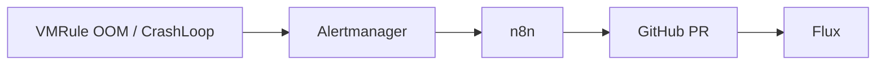

# Closed-Loop Alerting → n8n → GitHub PR

VictoriaMetrics → Alertmanager → n8n (`ai-ops`) → LLM → **GitHub** Pull Request auf `kreativmonkey/homelab-gitops`.

Forgejo (`git.f4mily.net`) ist nur Backup-Mirror; Auto-Remediation schreibt ausschließlich nach GitHub.



## Repository

| Setting | Default (HelmRelease env) |
|---------|---------------------------|
| Owner | `kreativmonkey` |
| Repo | `homelab-gitops` |
| Manifests path | `gitops-homelab/` |
| Branch | `main` |

Remote: `git@github.com:kreativmonkey/homelab-gitops.git`

## GitOps manifests

| Path | Purpose |
|------|---------|
| `apps/base/n8n/` | HelmRelease, Ingress, secrets |
| `apps/base/monitoring/rules/workload-remediation-vmrule.yaml` | Alerts |
| `apps/base/monitoring/vm-k8s-stack/helmrelease.yaml` | Receiver `n8n-remediation` |

Webhook (in-cluster): `http://n8n-app.ai-ops.svc.cluster.local:5678/webhook/vmalert`

## Bootstrap

1. **SOPS secrets** (`apps/base/n8n/`):

   ```bash
   cd apps/base/n8n
   just sops-create n8n-encryption-key ai-ops encryption-key="$(openssl rand -hex 32)"
   just sops-create n8n-integration-credentials ai-ops \
     github-token='github_pat_xxx' \
     llm-api-key='sk-xxx' \
     llm-base-url='https://api.openai.com/v1'
   ```

2. Ensure both `*.secret.yaml` are listed in `kustomization.yaml`.
3. Flux reconcile; n8n image is pinned in HelmRelease (`n8nio/n8n:2.21.7`). See [n8n-auth.md](n8n-auth.md) for UI OAuth vs webhooks.
4. Import workflow (uses pod env — **no** n8n Credentials UI for GitOps flow):

   ```bash
   export KUBECONFIG=../homelab-infrastructure/talos/kubeconfig
   just n8n-bootstrap
   ```

   If `kubectl exec` fails with `no route to host` on `100.96.x.x:10250`, your machine cannot reach
   node/kubelet IPs (API works via `192.168.10.245`, exec does not). Either add Netbird routes
   ([netbird-cluster-access.md](../netbird-cluster-access.md)) or use the API fallback:

   ```bash
   # n8n → Settings → API → Create API key
   export N8N_API_KEY='n8n_api_…'
   just n8n-bootstrap
   ```

### GitHub token

**Fine-grained** (empfohlen): Repository `homelab-gitops` → Permissions:

- Contents: Read and write
- Pull requests: Read and write

**Classic**: Scope `repo`.

Token is read from Secret key `github-token` → pod env `GITHUB_TOKEN` (not stored in n8n credential store).

## Workflow (GitHub REST)

1. `GET /repos/{owner}/{repo}/git/ref/heads/{base}` → SHA
2. `POST /repos/{owner}/{repo}/git/refs` → Branch `auto/remediate-…`
3. `PUT /repos/{owner}/{repo}/contents/{path}` → YAML-Datei (base64)
4. `POST /repos/{owner}/{repo}/pulls` → PR

## Error notifications

When the remediation workflow fails, n8n can run a linked **error workflow**:

| File | Role |
|------|------|
| `homelab-gitops-remediation-error.workflow.json` | Error Trigger → format message → **ntfy** |

1. Add `ntfy-url` and `ntfy-token` to SOPS secret `n8n-integration-credentials` (reuse Alertmanager `monitoring` topic token).
2. `just n8n-bootstrap` with `N8N_API_KEY` links the error workflow in remediation settings.
3. Without API key: after import, set **Settings → Error workflow** → *Homelab GitOps Remediation — Error Notify* → Save.

Error workflows run only on **automatic** failures (not manual test runs in the editor).

## Safety

- PR-Review vor Merge; Flux reconciled von GitHub (primary remote).
- Allowlist: `KubePodOOMKilled`, `KubePodCrashLoopBackOff`, `KubePodCrashLooping`.
- Alertmanager route matched nur `alertname` (Label `homelab/auto_remediate` mit Slash bricht AM-Matcher).

## Test

### 1. Webhook erreichbar (von überall mit Ingress-Zugriff)

```bash
just n8n-test-webhook              # firing — voller Pfad (LLM → ggf. PR)
just n8n-test-webhook scenario=resolved   # früh abbrechen (skip)
just n8n-test-webhook scenario=skip       # falsches alertname
```

Erwartung: HTTP 200 und `{"message":"Workflow was started"}`.

In-Cluster (z. B. vom Cluster-Netz):

```bash
curl -sS -X POST "http://n8n-app.ai-ops.svc.cluster.local:5678/webhook/vmalert" \
  -H 'Content-Type: application/json' \
  -d '{"status":"firing","alerts":[{"labels":{"alertname":"KubePodCrashLoopBackOff","namespace":"default","pod":"demo","container":"app"},"annotations":{"summary":"test"}}]}'
```

### 2. Ausführung in n8n prüfen

1. https://n8n.cluster.f4mily.net → **Executions**
2. Letzter Lauf öffnen:
   - **resolved/skip:** Endet nach `Skip?` (grüner Pfad „true“ = skip)
   - **firing:** Läuft durch `LLM Kustomize Patch` → `Plan PR` → ggf. GitHub-Nodes
3. Fehler rot? Typisch: fehlender Workflow-Import (`just n8n-bootstrap`), leerer `LLM_API_KEY` / `GITHUB_TOKEN` im Pod:

   ```bash
   kubectl get secret -n ai-ops n8n-integration-credentials
   # Keys: github-token, llm-api-key, llm-base-url (optional)
   ```

### 3. End-to-end (optional)

Nach **firing**-Test: https://github.com/kreativmonkey/homelab-gitops/pulls — Branch `auto/remediate-*` nur wenn LLM `action: patch` liefert (Demo-Alert oft `noop` / `needs_human`).
