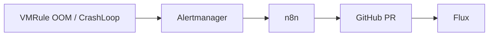

# Closed-Loop Alerting → n8n → GitHub PR

VictoriaMetrics → Alertmanager → n8n (`ai-ops`) → LLM → **GitHub** Pull Request auf `kreativmonkey/homelab-gitops`.

Forgejo (`git.f4mily.net`) ist nur Backup-Mirror; Auto-Remediation schreibt ausschließlich nach GitHub.



## Repository

| Setting | Default (HelmRelease env) |
|---------|---------------------------|
| Owner | `kreativmonkey` |
| Repo | `homelab-gitops` |
| Manifests path | `gitops-homelab/` |
| Branch | `main` |

Remote: `git@github.com:kreativmonkey/homelab-gitops.git`

## GitOps manifests

| Path | Purpose |
|------|---------|
| `apps/base/n8n/` | HelmRelease, Ingress, secrets |
| `apps/base/monitoring/rules/workload-remediation-vmrule.yaml` | Alerts |
| `apps/base/monitoring/vm-k8s-stack/helmrelease.yaml` | Receiver `n8n-remediation` |

Webhook (in-cluster): `http://n8n.ai-ops.svc.cluster.local:5678/webhook/vmalert`

## Bootstrap

1. **SOPS secrets** (`apps/base/n8n/`):

   ```bash
   cd apps/base/n8n
   just sops-create n8n-encryption-key ai-ops encryption-key="$(openssl rand -hex 32)"
   just sops-create n8n-integration-credentials ai-ops \
     github-token='github_pat_xxx' \
     llm-api-key='sk-xxx' \
     llm-base-url='https://api.openai.com/v1'
   ```

2. Uncomment both `*.secret.yaml` in `kustomization.yaml`.
3. Import `apps/base/n8n/workflows/homelab-gitops-remediation.workflow.json`.
4. n8n credential **GitHub PAT**: Header `Authorization` = `Bearer <token>`.

### GitHub token

**Fine-grained** (empfohlen): Repository `homelab-gitops` → Permissions:

- Contents: Read and write
- Pull requests: Read and write

**Classic**: Scope `repo`.

## Workflow (GitHub REST)

1. `GET /repos/{owner}/{repo}/git/ref/heads/{base}` → SHA
2. `POST /repos/{owner}/{repo}/git/refs` → Branch `auto/remediate-…`
3. `PUT /repos/{owner}/{repo}/contents/{path}` → YAML-Datei (base64)
4. `POST /repos/{owner}/{repo}/pulls` → PR

## Safety

- PR-Review vor Merge; Flux reconciled von GitHub (primary remote).
- Allowlist: nur `KubePodOOMKilled` / `KubePodCrashLoopBackOff`.

## Test

```bash
curl -sS -X POST "http://n8n.ai-ops.svc.cluster.local:5678/webhook/vmalert" \
  -H 'Content-Type: application/json' \
  -d '{"status":"firing","alerts":[{"labels":{"alertname":"KubePodCrashLoopBackOff","namespace":"default","pod":"demo","container":"app","homelab/auto_remediate":"true"},"annotations":{"summary":"test"}}]}'
```

Prüfen: n8n Executions → https://github.com/kreativmonkey/homelab-gitops/pulls
