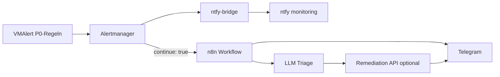

# Alerting → n8n → KI-Triage → Telegram

Automatische Auswertung von Homelab-Alerts, begrenzte Auto-Remediation und Telegram-Status mit Human-in-the-Loop.

## Architektur



| Kanal | Zweck |
|-------|--------|
| **ntfy** | Schnelle Push-Benachrichtigung (bestehend) |
| **n8n** | Strukturierte AM-JSON-Payload, KI-Entscheidung, Telegram mit Status |
| **Telegram** | Zusammenfassung, Auto-Fix-Ergebnis, Rückfragen (Human-in-the-Loop) |

Alertmanager sendet **parallel** zu ntfy auch an n8n (`continue: true`), nur für Alerts mit Label `homelab/owner=platform` und `severity` critical/warning.

## Voraussetzungen

1. **n8n** erreichbar vom Cluster (z. B. `https://n8n.f4mily.net` oder In-Cluster-Service).
2. **Telegram-Bot** ([@BotFather](https://t.me/BotFather)) → Bot-Token in n8n Credentials.
3. **LLM** in n8n (OpenAI, Anthropic oder lokales Ollama) — Credential in n8n anlegen.
4. **Webhook-Secret** (gemeinsam für AM → n8n und optional Remediation-API).

## Einrichtung (Schritte)

### 1. n8n-Workflow importieren

Datei: [`apps/base/monitoring/n8n-workflows/homelab-alert-triage.workflow.json`](../../apps/base/monitoring/n8n-workflows/homelab-alert-triage.workflow.json)

1. n8n → **Workflows** → **Import from File**
2. Credentials zuweisen: **OpenAI** (oder Node auf Ollama umstellen), **Telegram**
3. Workflow-Variablen / Umgebung in n8n setzen:

| Variable | Beispiel | Beschreibung |
|----------|----------|--------------|
| `TELEGRAM_CHAT_ID` | `123456789` | Deine Chat-ID (`@userinfobot`) |
| `WEBHOOK_SECRET` | zufällig 32+ Zeichen | Muss mit Alertmanager-Header übereinstimmen |
| `REMEDIATION_URL` | leer oder `http://homelab-remediation...` | Optional Phase 2 |

4. Workflow **aktivieren** → Production-Webhook-URL kopieren. Alertmanager unterstützt **keine Custom-HTTP-Header** — das Secret steckt als Query-Parameter:

   `http://n8n-app.ai-ops.svc.cluster.local:5678/webhook/homelab-alert?webhookSecret=DEIN_LANGES_SECRET`

   Dieselbe Zeichenkette in n8n als `WEBHOOK_SECRET` und in SOPS als `url` (komplette URL).

   > **Hinweis:** n8n 2.23.1 registriert keine Webhooks mit dynamischen Pfad-Parametern (`:webhookSecret`) im Production-Modus. Daher wird das Secret als Query-Parameter übergeben. Der Workflow-Code prüft `params`, `query` und `headers` auf das Secret.

### 2. SOPS-Secret für Alertmanager

```bash
cd apps/base/monitoring/notifications
# SOPS_AGE_KEY_FILE gesetzt
just sops-create alertmanager-n8n-webhook monitoring \
  url='http://n8n-app.ai-ops.svc.cluster.local:5678/webhook/homelab-alert?webhookSecret=DEIN_LANGES_SECRET'
```

`kustomization.yaml` unter `notifications/` enthält die verschlüsselte Datei nach dem Erzeugen.

### 3. Flux / Helm reconcile

```bash
flux reconcile helmrelease vm-k8s-stack -n monitoring
```

### 4. Test

```bash
# AM-Testpayload (vereinfacht)
curl -X POST "http://n8n-app.ai-ops.svc.cluster.local:5678/webhook/homelab-alert?webhookSecret=$SECRET" \
  -H "Content-Type: application/json" \
  -d '{"status":"firing","alerts":[{"labels":{"alertname":"HomelabAlertingTest","severity":"critical","homelab/owner":"platform","homelab/auto_triage":"true"},"annotations":{"summary":"Test"}}]}'
```

Erwartung: Telegram-Nachricht mit Triage-Ergebnis (kein Auto-Fix bei unbekanntem Alertnamen).

## Workflow-Logik (Kurz)

1. **Webhook** empfängt Alertmanager-JSON, prüft Secret als Query-Parameter (`?webhookSecret=...`).
2. **Parse** extrahiert `alertname`, `severity`, Runbook, `homelab/auto_triage`.
3. **Resolved** → Telegram „behoben“, Ende.
4. **Firing** → LLM bewertet Handlungsbedarf (Runbook-Kontext im Prompt).
5. **Routing**
   - `no_action` / Lärm → nur Info-Telegram
   - `needs_human` → Telegram + Hinweis „Rückmeldung nötig“
   - `cannot_fix` → Telegram „Agent blockiert“
   - `automatable` + Allowlist + `homelab/auto_triage=true` → optional Remediation-HTTP → Telegram Ergebnis

### Auto-Fix-Allowlist (v1)

Nur diese Alertnamen dürfen **ohne deine Freigabe** eine Remediation-API aufrufen:

| Alert | Aktion (Beispiel) |
|-------|-------------------|
| `NtfyBridgeDown` | `kubectl rollout restart deployment/ntfy-bridge -n monitoring` |

Alles andere (CNPG, Node-Disk, Velero, …) → **nur** Telegram + LLM-Vorschlag, kein automatischer Cluster-Eingriff.

Label in VMRules setzen:

```yaml
labels:
  homelab/auto_triage: "true"   # nur wo Auto-Fix erlaubt ist
```

## Human-in-the-Loop (Phase 2)

Im importierten Workflow ist ein **Telegram-Reply**-Pfad vorbereitet (Node deaktiviert / Notiz):

- Inline-Buttons: `✅ Freigeben` / `❌ Ablehnen` / `📋 Details`
- n8n **Wait**-Node wartet auf Callback
- Freigabe → Remediation-Subworkflow

Aktivierung: Telegram-Trigger-Node + Bot-Webhook in n8n; siehe Kommentar im Workflow.

## KI-Agent „behebt Fehler“ — realistische Stufen

| Stufe | Was | Sicherheit |
|-------|-----|------------|
| **v1 (jetzt)** | LLM klassifiziert + Text an Telegram; Auto-Fix nur Allowlist | Niedriges Risiko |
| **v2** | Kleiner `homelab-remediation` Service im Cluster (JWT, Allowlist kubectl) | RBAC nur `monitoring` Namespace |
| **v3** | GitOps: Agent öffnet Forgejo-PR (`.opencode/agents/k8s-specialist`) | Review vor Merge |

**Nicht empfohlen:** Vollautomatisches `kubectl` aus n8n mit Cluster-Admin — ein falscher Prompt kann mehr kaputt machen als der Ausfall.

## Phase 2: Remediation-API (optional)

Separater Deployment (noch nicht im Repo):

- POST `/v1/remediate` mit `{ "alertname", "action" }`
- Prüft JWT + Allowlist + Audit-Log
- Führt nur vordefinierte Actions aus

n8n-Node **Call Remediation** nutzt `REMEDIATION_URL` — solange leer, überspringt der Workflow den Schritt.

## Sicherheit

- Webhook-Secret rotieren, wenn geleakt.
- n8n nicht öffentlich ohne Auth (Reverse-Proxy, Netbird, Basic Auth).
- LLM-API-Keys nur in n8n Credentials, nicht in Git.
- Telegram-Chat-ID ist personenbezogen — nicht committen.

## Troubleshooting

| Symptom | Prüfung |
|---------|---------|
| Kein Telegram | n8n Execution Log; `TELEGRAM_CHAT_ID`; Bot gestartet (`/start`) |
| 401 Webhook | Secret in AM-`url` (Query-Param) vs. n8n `WEBHOOK_SECRET` |
| Doppelte ntfy + n8n OK | `continue: true` auf Route `n8n-triage` |
| LLM Timeout | Modell/kürzerer Prompt; Ollama lokal |

## Referenzen

- Workflow: `apps/base/monitoring/n8n-workflows/`
- AM-Config: `apps/base/monitoring/vm-k8s-stack/helmrelease.yaml`
- P0-Regeln: `apps/base/monitoring/rules/platform-p0-vmrule.yaml`
- Plan: `KI-ALERT-PLAN.md` Phase 6
