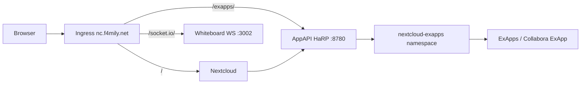

# Nextcloud Whiteboard, AppAPI HaRP, and Collabora options

Real-time Whiteboard collaboration and ExApps (e.g. future Collabora via AppAPI) need extra components beside the Nextcloud PHP pod.

## Architecture



| Component | Purpose |
|-----------|---------|
| **Whiteboard server** | WebSocket backend for live whiteboard sessions (`/socket.io/`) |
| **AppAPI HaRP** | Deploy daemon for ExApps; proxies `/exapps/` to microservices |
| **nextcloud-exapps** | Namespace where AppAPI creates ExApp pods and services |

## 1. Secrets (GitOps)

From `gitops-homelab/` with `SOPS_AGE_KEY_FILE` set:

```bash
just nextcloud-collab-secrets
```

Creates `apps/base/nextcloud/nextcloud-collab.secret.yaml`:

- `whiteboard-jwt-secret` — shared with the Whiteboard container and `occ config:app:set whiteboard jwt_secret_key`
- `harp-shared-key` — HaRP `HP_SHARED_KEY` and AppAPI daemon registration

Commit, push, Flux reconcile.

## 2. What GitOps deploys

- `nextcloud-whiteboard` — `ghcr.io/nextcloud-releases/whiteboard:stable`
- `appapi-harp` — `ghcr.io/nextcloud/nextcloud-appapi-harp:release` with `HP_K8S_ENABLED=true`
- Ingress paths on `nc.f4mily.net`:
  - `/socket.io/` → Whiteboard (WebSocket)
  - `/exapps/` → HaRP (ExApps + WebSocket where needed)
- Init container `occ-collab-setup` enables `whiteboard` + `app_api`, configures JWT/URL, registers K8s deploy daemon `k8s_homelab`

## 3. Verify Whiteboard

After reconcile and pod restart:

1. Admin → Whiteboard — warning about WebSocket should be gone.
2. Browser DevTools → Network → filter **WS** — connection to `wss://nc.f4mily.net/socket.io/…` should stay open.
3. Open a whiteboard with two users and confirm live cursors.

Manual check:

```bash
kubectl -n nextcloud exec deploy/nextcloud -- php occ config:app:get whiteboard collabBackendUrl
kubectl -n nextcloud exec deploy/nextcloud -- php occ app_api:daemon:list
```

## 4. Verify AppAPI HaRP

1. Admin → Administration → AppAPI → Deploy daemon **K8s Homelab** should appear.
2. Use **Test deploy** in the daemon menu (deploys a skeleton ExApp into `nextcloud-exapps`).
3. HaRP info endpoint (from cluster):

```bash
HARP_KEY="$(kubectl -n nextcloud get secret nextcloud-collab -o jsonpath='{.data.harp-shared-key}' | base64 -d)"
kubectl -n nextcloud run curl-test --rm -it --restart=Never --image=curlimages/curl -- \
  curl -fsS -H "harp-shared-key: ${HARP_KEY}" http://appapi-harp:8780/exapps/app_api/info
```

Response should include `"kubernetes": {"enabled": true, ...}`.

## 5. Collabora: two paths

### Option A — Classic Collabora Online (recommended for Office)

Deploy **Collabora Online** (`collabora/code`) as a normal Kubernetes workload (Deployment + Service + Ingress), enable Nextcloud app **Office** (`richdocuments`), point WOPI URL to Collabora.

**Pros:** Mature, well-documented, no ExApp dependency.  
**Cons:** Separate manifest set; not managed by AppAPI.

Typical next step: add `apps/base/collabora/` with ingress `office.f4mily.net` or path on `nc.f4mily.net`, configure `richdocuments` via occ.

### Option B — Collabora as ExApp via AppAPI

With HaRP + K8s daemon working, install Collabora from the App Store as an **ExApp** (if offered for your Nextcloud version).

**Pros:** Single AppAPI workflow; upgrades via Nextcloud UI.  
**Cons:** Newer path; resource limits and persistence need AppAPI/K8s tuning; depends on ExApp packaging quality.

**Recommendation:** Use **Option A** for production Office editing unless you explicitly want everything via AppAPI. Keep HaRP for other ExApps (AI, etc.).

## 6. RBAC note

HaRP uses a `cluster-admin` binding for `appapi-harp` (same as upstream AppAPI K8s CI). This is broad but required for dynamic ExApp lifecycle. Scope can be tightened later with a custom ClusterRole if you catalog exact verbs AppAPI needs.

## References

- [Whiteboard README](https://github.com/nextcloud/whiteboard)
- [AppAPI deploy daemons](https://docs.nextcloud.com/server/stable/admin_manual/exapps_management/ManagingDeployDaemons.html)
- [HaRP](https://github.com/nextcloud/HaRP)
