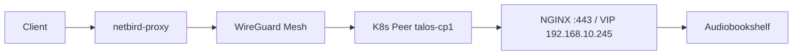

# Netbird Reverse Proxy — Homelab-Services ohne Port-Forwarding

Mit dem [Netbird Reverse Proxy](https://docs.netbird.io/manage/reverse-proxy) (ab v0.65) erreichst du interne Dienste von außen über HTTPS. Der Traffic läuft über die Netbird-Infrastruktur (`netbird.f4mily.net`); am Router musst du **keine** zusätzlichen Ports für einzelne Apps öffnen.

Offizielle Referenzen: [Reverse Proxy](https://docs.netbird.io/manage/reverse-proxy), [Troubleshooting](https://docs.netbird.io/manage/reverse-proxy/troubleshooting), [Access Logs](https://docs.netbird.io/manage/reverse-proxy/access-logs).

## Architektur (Homelab)

Der **Reverse Proxy** baut den Tunnel zum Ziel über das Management — es gibt **keine** separate Dashboard-Policy mit Source-Gruppe `netbird-proxy`. Das war eine Fehleinschätzung in einer früheren Doku-Version.

## 502 „request failed“ — typische Ursache im Talos-Cluster

Proxy Events mit **Status 502** und **Reason `request failed`** bedeuten: der Proxy hat die Anfrage angenommen, aber das **Backend** (dein Ziel) antwortet nicht — siehe [Access Logs](https://docs.netbird.io/manage/reverse-proxy/access-logs) (5xx = Backend/Connectivity).

### Issue 1: Ziel-IP = Routing-Peer selbst (sehr häufig hier)

Wenn der **Netbird-Client auf denselben Nodes** läuft wie der Ingress (DaemonSet + `hostNetwork`) und du als Reverse-Proxy-Ziel eine **Network Resource** (`Host`/`Subnet` → `192.168.10.245`) nutzt, trifft genau [Issue 1 in der offiziellen Doku](https://docs.netbird.io/manage/reverse-proxy/troubleshooting#issue-1-502-errors-when-routing-peer-forwards-to-its-own-ip) zu:

- Der Routing Peer soll Subnet-Traffic **an andere Hosts** weiterleiten.
- Leitet er auf eine **eigene** IP (hier die Ingress-VIP auf dem Node), fehlen die ACL-Regeln für „self-targeted“ Traffic → Timeout → **502**.

**Lösung für `audible.f4mily.net` (und alle Cluster-Ingress-Hosts):**

| Feld | Wert |
|------|------|
| Target type | **Peer** (nicht Host/Subnet/Network Resource) |
| Peer | z. B. `talos-cp1` (beliebiger K8s-Node mit Netbird + Ingress) |
| Protocol / Port | **HTTPS** / **443** |
| Pass Host Header | **An** |
| Rewrite Redirects | **An** |
| Domain | Custom: `audible.f4mily.net` |

Der Ingress lauscht per `hostNetwork` auf dem Node; der WireGuard-Tunnel endet auf dem Peer — kein Subnet-Forward-Hop nötig.

**Alternative:** Netbird nur auf einem **anderen** Host (z. B. `srv1` / `192.168.10.23`) als Routing Peer — dann darf `Host` `192.168.10.245` wieder funktionieren, weil die VIP nicht die Peer-eigene Adresse ist.

### Weitere 502-Ursachen (Checkliste)

1. Service-Status im Dashboard **active** (nicht `tunnel_not_created`).
2. Vom Routing Peer lokal testen: `curl -skI -H 'Host: audible.f4mily.net' https://192.168.10.245/`
3. Backend bindet nicht nur `127.0.0.1` — Ingress ist OK (`hostNetwork`).
4. Audiobookshelf: Ingress-Pfad `/audiobookshelf` + `app-root` `/` — Root-URL sollte redirecten; bei Problemen Path `/audiobookshelf` im Proxy-Target setzen.
5. Self-hosted Debug: `NB_PROXY_DEBUG_ENDPOINT=true` → `netbird-proxy debug ping <account-id> 192.168.10.245 443`

## Netbird-Server (Docker)

[Enable Reverse Proxy](https://docs.netbird.io/selfhosted/migration/enable-reverse-proxy): `netbirdio/reverse-proxy`, Traefik **TLS passthrough**, `NB_PROXY_DOMAIN`, Token, DNS `proxy` / `*.proxy` → `netbird.f4mily.net`.

## Kubernetes (GitOps)

- DaemonSet `netbird` in `netbird`, Client ≥ 0.71, Namespace **privileged**.
- Optional **Networks** `k8s-ingress` für VPN-Zugriff auf `192.168.10.0/24` (Mesh-Clients) — Routing Peers = K8s-Peer-Gruppe, Masquerade an, Policies Source = deine Client-Gruppen → Resource-Gruppe.
- **Reverse Proxy** zum Ingress: Target-Typ **Peer**, nicht die Network Resource.

## DNS `audible.f4mily.net`

- **Öffentlich:** CNAME → `netbird.f4mily.net` (Reverse Proxy-TLS).
- **Lokal (AdGuard):** A → `192.168.10.245` (direkt im LAN).

Terraform: `homelab-infrastructure/dns/servers.tf` (`audible` public CNAME).

## Beispiel-Checkliste `audible`

- [ ] Reverse-Proxy-Service: Target **Peer** `talos-cp1`, HTTPS **443**, Host Header + Rewrite an
- [ ] Service-Status **active**
- [ ] Proxy Events: kein 502 mehr
- [ ] Öffentlich: `dig audible.f4mily.net` → Netbird-Host, nicht `192.168.10.245`
- [ ] `https://audible.f4mily.net` von außen (ohne VPN)

## Links

- [Troubleshooting (Issue 1)](https://docs.netbird.io/manage/reverse-proxy/troubleshooting#issue-1-502-errors-when-routing-peer-forwards-to-its-own-ip)
- [Backend trusted proxies `100.64.0.0/10`](https://docs.netbird.io/manage/reverse-proxy/service-configuration)
- [Cluster-Routing-Peers](netbird-cluster-access.md)
