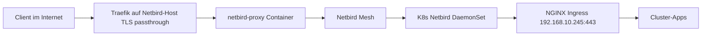

# Netbird Reverse Proxy — Homelab-Services ohne Port-Forwarding

Mit dem [Netbird Reverse Proxy](https://docs.netbird.io/manage/reverse-proxy) (ab v0.65) erreichst du interne Dienste von außen über HTTPS. Der Traffic läuft über die Netbird-Infrastruktur (`netbird.f4mily.net`); am Router musst du **keine** zusätzlichen Ports für einzelne Apps öffnen — nur das, was der Netbird-Host ohnehin braucht (typisch **443/tcp**, **3478/udp** für STUN).

## Architektur

| Ebene | Aufgabe |
|-------|---------|
| **DNS** (`*.srv1` → `netbird.f4mily.net`) | Öffentliche Namen zeigen auf den Netbird-Server |
| **netbird-proxy** + Traefik | TLS, Zertifikate, Auth, Tunnel zum Ziel |
| **K8s Netbird-Client** | Routing-Peer: erreicht `192.168.10.0/24` und Cluster-CIDRs |
| **Ingress** | VHost-Routing per `Host`-Header (`search.f4mily.net`, …) |

## Teil 1: Netbird-Server (Docker, einmalig)

Folge der offiziellen Anleitung: [Enable Reverse Proxy](https://docs.netbird.io/selfhosted/migration/enable-reverse-proxy).

Kurzüberblick:

1. **Traefik** vor dem Netbird-Stack (TLS **passthrough** auf Port 443 — kein TLS-Terminate vor dem Proxy).
2. Container **`netbirdio/reverse-proxy`** mit `proxy.env`:
   - `NB_PROXY_DOMAIN=proxy.f4mily.net` (oder `netbird.f4mily.net`, wenn alles unter einer Domain bleiben soll)
   - `NB_PROXY_TOKEN=nbx_…` (via `netbird-server token create`)
   - `NB_PROXY_MANAGEMENT_ADDRESS=http://netbird-server:80` (im Docker-Netz)
   - `NB_PROXY_ACME_CERTIFICATES=true`
3. **DNS** beim Registrar / Hetzner:
   - `A` `netbird` → öffentliche IP des Netbird-Hosts
   - `CNAME` `proxy` → `netbird.f4mily.net`
   - `CNAME` `*.proxy` → `netbird.f4mily.net` (für Cluster-Domains wie `search.proxy.f4mily.net`)

Management und Dashboard auf **≥ 0.65** aktualisieren (`docker compose pull && up -d`).

## Teil 2: Kubernetes (GitOps)

- Namespace `netbird`: **privileged** Pod-Security (hostNetwork, NET_ADMIN).
- DaemonSet: Client **≥ 0.67** (kompatibel mit Reverse Proxy).
- **Network Routes** im Dashboard (Peers der Setup-Key-Gruppe):

| Netz | Zweck |
|------|--------|
| `10.244.0.0/16` | Pods |
| `10.96.0.0/12` | Services |
| `192.168.10.0/24` | Ingress-VIP `192.168.10.245`, Nodes |

Ohne diese Routen sieht der Proxy den Ingress nicht.

## Teil 3: Services im Dashboard

**Reverse Proxy → Services → Add Service**

### Empfohlen: eine HTTP-Service-Instanz pro App (Custom Domain)

Passt zu bestehenden Ingress-Hostnames (`search.f4mily.net`, `pdf.f4mily.net`, `*.cluster.f4mily.net`, …), sofern DNS bereits auf `netbird.f4mily.net` zeigt (z. B. `*.srv1`).

| Feld | Wert |
|------|------|
| Mode | **HTTP** |
| Domain | Custom: z. B. `search.f4mily.net` |
| Target type | **Host** (oder Subnet + IP) |
| Target | `192.168.10.245` |
| Protocol / Port | **HTTPS** / **443** |
| Settings | **Pass Host Header** = an (Ingress braucht den öffentlichen Hostnamen) |
| Settings | **Rewrite Redirects** = an (verhindert Redirects auf interne URLs) |
| Authentication | SSO / Passwort / PIN nach Bedarf (öffentliche URLs sonst warnung im UI) |

Wiederhole für jede App, die von extern erreichbar sein soll.

### Alternative: Cluster-Domain unter `proxy.f4mily.net`

| Feld | Wert |
|------|------|
| Subdomain | z. B. `search` |
| Base domain | `proxy.f4mily.net` (Cluster-Badge im UI) |
| Target | wie oben |

Erreichbar dann als `https://search.proxy.f4mily.net` — ohne extra CNAME pro App, sofern `*.proxy` DNS gesetzt ist.

### Path-basiert (eine URL, mehrere Backends)

Mehrere Targets mit unterschiedlichen **Path**-Präfixen (`/api`, `/`) — nur sinnvoll, wenn die Apps Pfade unter einer Domain teilen.

## Beispiel-Checkliste

- [ ] `netbird-proxy` läuft, Status im Dashboard: Proxy-Instanz **connected**
- [ ] Traefik TCP-Router TLS passthrough → Proxy `:8443`
- [ ] K8s: `kubectl get pods -n netbird` → 3/3 Ready
- [ ] Network Routes aktiv
- [ ] Service `search.f4mily.net` → Target `192.168.10.245:443`, Status **active**
- [ ] Test von Mobilfunk ohne VPN: `https://search.f4mily.net`

## Hinweise

- **Rosenpass**: Reverse Proxy funktioniert derzeit nicht mit Rosenpass.
- **Backends** (Nextcloud, Jellyfin, …): ggf. „trusted proxies“ / `trusted_domains` für Netbird-IP-Bereiche — siehe [Service configuration](https://docs.netbird.io/manage/reverse-proxy/service-configuration).
- **L4** (SSH, DB): separater Modus TCP/TLS; extra Ports in `docker-compose` freigeben — siehe [L4 ports](https://docs.netbird.io/selfhosted/migration/enable-reverse-proxy#exposing-l4-ports).
- Schnelltest ohne Dashboard: `netbird expose` auf einem Peer (CLI) — eher für temporäre Freigaben.

## Links

- [Reverse Proxy Docs](https://docs.netbird.io/manage/reverse-proxy)
- [Cluster-Routing-Peers](netbird-cluster-access.md)
- [External Traefik Setup](https://docs.netbird.io/selfhosted/external-reverse-proxy)
