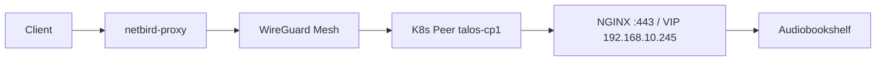

# Netbird Reverse Proxy — Homelab-Services ohne Port-Forwarding

Mit dem [Netbird Reverse Proxy](https://docs.netbird.io/manage/reverse-proxy) (ab v0.65) erreichst du interne Dienste von außen über HTTPS. Der Traffic läuft über die Netbird-Infrastruktur (`netbird.f4mily.net`); am Router musst du **keine** zusätzlichen Ports für einzelne Apps öffnen.

Offizielle Referenzen: [Reverse Proxy](https://docs.netbird.io/manage/reverse-proxy), [Troubleshooting](https://docs.netbird.io/manage/reverse-proxy/troubleshooting), [Access Logs](https://docs.netbird.io/manage/reverse-proxy/access-logs).

## Universelles Pattern für Cluster-Services

**Im Dashboard (für jeden Service identisch):**

| Feld | Wert |
|------|------|
| Service mode | **HTTP** |
| Target type | **Peer** (`talos-cp1` o. ä.) — Cluster-Node mit `hostNetwork`-Ingress |
| Protocol / Port | **HTTP** / **80** |
| Path | **leer** |
| Pass Host Header | **An** |
| Rewrite Redirects | **An** |
| Domain | Custom z. B. `audible.f4mily.net` |
| Skip TLS Verification | irrelevant (HTTP, nicht HTTPS) |

**Im Cluster (GitOps):** Ingress-Annotation `nginx.org/redirect-to-https: "true"` statt `nginx.org/ssl-redirect: "true"`. Damit respektiert NGINX den `X-Forwarded-Proto`-Header und verursacht keine Redirect-Schleife mit Netbird.

**Warum nicht HTTPS/443 zum Backend?** Bekannter Netbird-Bug — siehe [Issue 0](#issue-0-protocol-https-im-http-service-sehr-häufig-nicht-das-zertifikat).

## Architektur (Homelab)

Der **Reverse Proxy** baut den Tunnel zum Ziel über das Management — es gibt **keine** separate Dashboard-Policy mit Source-Gruppe `netbird-proxy`. Das war eine Fehleinschätzung in einer früheren Doku-Version.

## 502 „request failed“ — typische Ursache im Talos-Cluster

Proxy Events mit **Status 502** und **Reason `request failed`** bedeuten: der Proxy hat die Anfrage angenommen, aber das **Backend** (dein Ziel) antwortet nicht — siehe [Access Logs](https://docs.netbird.io/manage/reverse-proxy/access-logs) (5xx = Backend/Connectivity).

### Issue 0: Protocol „HTTPS“ im HTTP-Service (sehr häufig, nicht das Zertifikat)

**Symptom:** 502 Bad Gateway bei Protocol HTTPS/443, auch mit gültigem Let's-Encrypt-Cert und „Skip TLS Verification“ angeklickt.

**Ursache:** Offener Netbird-Bug ([netbirdio/netbird#5514](https://github.com/netbirdio/netbird/issues/5514), [#5461](https://github.com/netbirdio/netbird/issues/5461)) — der HTTP-Service-Modus kann beim Upstream-TLS-Handshake kein SNI/Origin-Name setzen. Trifft besonders strikte Backends wie **F5-NGINX-Ingress**. Bei Docker-Hosts mit Traefik/Caddy fällt es weniger auf, weil deren Default-Cert ohne SNI-Match akzeptiert wird.

**Warum „Skip TLS Verification“ nicht reicht:** Der Toggle deaktiviert nur die Zertifikatsprüfung. Der Handshake bricht aber davor/danach ab — SNI fehlt, Default-Backend von NGINX antwortet nicht passend.

**Lösung:** Im Dashboard **HTTP / 80**. Öffentlich bleibt es für Browser HTTPS (Netbird terminiert am Edge); nur die letzte Strecke Proxy → NGINX ist Cluster-intern HTTP. Das ist Standard-Pattern hinter TLS-terminierenden Edge-Proxies.

**Wenn echtes TLS bis NGINX gebraucht wird:** L4-Service-Modus **TLS** (SNI-Passthrough) auf Peer-Port **443** — nicht HTTP-Service mit Protocol HTTPS.

### Issue „Redirect Loop“ mit HTTP-Backend

**Symptom:** Browser → `http://*.f4mily.net` über Netbird → „ERR_TOO_MANY_REDIRECTS“.

**Ursache:** `nginx.org/ssl-redirect: "true"` redirected **bedingungslos** http→https. Mit `Rewrite Redirects: An` schreibt Netbird die Location auf die öffentliche URL um → erneut über Netbird → Loop.

**Lösung (global im GitOps gesetzt):** `nginx.org/redirect-to-https: "true"`. Diese F5-Annotation prüft `X-Forwarded-Proto` und redirected **nicht**, wenn der Header fehlt (Netbird-Pfad) oder bereits `https` ist.

| Annotation | Verhalten | Geeignet für Netbird? |
|------------|-----------|-----------------------|
| `nginx.org/ssl-redirect` | Immer http→https | ❌ Loop |
| `nginx.org/redirect-to-https` | Nur wenn `X-Forwarded-Proto != https` | ✅ |

### Issue 1: Ziel-IP = Routing-Peer selbst (sehr häufig hier)

Wenn der **Netbird-Client auf denselben Nodes** läuft wie der Ingress (DaemonSet + `hostNetwork`) und du als Reverse-Proxy-Ziel eine **Network Resource** (`Host`/`Subnet` → `192.168.10.245`) nutzt, trifft genau [Issue 1 in der offiziellen Doku](https://docs.netbird.io/manage/reverse-proxy/troubleshooting#issue-1-502-errors-when-routing-peer-forwards-to-its-own-ip) zu:

- Der Routing Peer soll Subnet-Traffic **an andere Hosts** weiterleiten.
- Leitet er auf eine **eigene** IP (hier die Ingress-VIP auf dem Node), fehlen die ACL-Regeln für „self-targeted“ Traffic → Timeout → **502**.

**Lösung:** Target-Typ **Peer** (`talos-cp*`), nicht Host/Subnet `192.168.10.245`. Siehe „Universelles Pattern“ oben. GitOps stellt `NB_ENABLE_LOCAL_FORWARDING=true` sicher, damit Tunnel-Traffic die lokalen `hostNetwork`-Listener (NGINX) erreicht.

**Routing Peer auf anderem Host** (z. B. `srv1`): Target **Host** `192.168.10.245`, **HTTP 80** — funktioniert ebenfalls.

### Weitere 502-Ursachen (Checkliste)

1. Service-Status im Dashboard **active** (nicht `tunnel_not_created`).
2. Vom Routing Peer lokal testen: `curl -sI -H 'Host: audible.f4mily.net' http://192.168.10.245/` → erwartet 200/302.
3. Backend bindet nicht nur `127.0.0.1` — Ingress ist OK (`hostNetwork`).
4. Ingress-Annotation `redirect-to-https`, nicht `ssl-redirect`.
5. Self-hosted Debug: `NB_PROXY_DEBUG_ENDPOINT=true` → `netbird-proxy debug ping <account-id> 192.168.10.245 80`

## Netbird-Server (Docker)

[Enable Reverse Proxy](https://docs.netbird.io/selfhosted/migration/enable-reverse-proxy): `netbirdio/reverse-proxy`, Traefik **TLS passthrough**, `NB_PROXY_DOMAIN`, Token, DNS `proxy` / `*.proxy` → `netbird.f4mily.net`.

## Kubernetes (GitOps)

- Namespace `netbird`: **privileged** Pod-Security (`hostNetwork`, NET_ADMIN).
- DaemonSet `netbird`: Client **≥ 0.71**.
- **Network Routes** im Dashboard (Peers der Setup-Key-Gruppe):

| Netz | Zweck |
|------|--------|
| `10.244.0.0/16` | Pods |
| `10.96.0.0/12` | Services |
| `192.168.10.0/24` | Ingress-VIP `192.168.10.245`, Nodes |

Ohne diese Routen sieht der Proxy den Ingress nicht.

- Optional **Networks** `k8s-ingress` für VPN-Zugriff auf `192.168.10.0/24` (Mesh-Clients) — Routing Peers = K8s-Peer-Gruppe, Masquerade an, Policies Source = deine Client-Gruppen → Resource-Gruppe.
- **Reverse Proxy** zum Ingress: Target-Typ **Peer**, nicht die Network Resource.

## Services im Dashboard

**Reverse Proxy → Services → Add Service**

### Empfohlen: eine HTTP-Service-Instanz pro App (Custom Domain)

Passt zu bestehenden Ingress-Hostnames (`audible.f4mily.net`, `search.f4mily.net`, `*.cluster.f4mily.net`, …), sofern DNS öffentlich auf Netbird zeigt (z. B. CNAME → `netbird.f4mily.net`).

| Feld | Wert |
|------|------|
| Mode | **HTTP** |
| Domain | Custom: z. B. `search.f4mily.net` |
| Target type | **Peer** (K8s-Ingress auf demselben Node) **oder** **Host** `192.168.10.245` (Routing Peer z. B. `srv1`) |
| Protocol / Port | **HTTP** / **80** (siehe Issue 0) |
| Path | **leer** |
| Settings | **Pass Host Header** = an |
| Settings | **Rewrite Redirects** = an |
| Authentication | SSO / Passwort / PIN nach Bedarf |

**Voraussetzung im Cluster:** Ingress-Annotation `nginx.org/redirect-to-https` statt `nginx.org/ssl-redirect` (sonst Endlosschleife — siehe Redirect-Loop-Abschnitt).

### Alternative: Cluster-Domain unter `proxy.f4mily.net`

Netbird-verwaltete Subdomain statt Custom Domain — siehe [Reverse Proxy](https://docs.netbird.io/manage/reverse-proxy).

## DNS `audible.f4mily.net`

- **Öffentlich:** CNAME → `netbird.f4mily.net` (Reverse Proxy-TLS).
- **Lokal (AdGuard):** A → `192.168.10.245` (direkt im LAN).

Terraform: `homelab-infrastructure/dns/servers.tf` (`audible` public CNAME).

## VIP `192.168.10.245` im Cluster

Über **Networks** (IP-Routing, kein DNS für „245“):

| Komponente | Zweck |
|------------|--------|
| Resource `192.168.10.245/32` oder `192.168.10.0/24` | Ingress-VIP |
| Routing Peers | K8s-Netbird-Nodes und/oder andere Server im LAN (`srv1`, …) |
| Reverse Proxy | Ziel **Host** `192.168.10.245` + Routing Peer auf **anderem** Host |

Der K8s-DaemonSet kann als Routing Peer die VIP im Mesh bekannt machen; für den öffentlichen Reverse Proxy reicht oft ein Peer außerhalb der CP-Nodes.

## Symptom-Tabelle

| Symptom | Ursache | Fix |
|---------|---------|-----|
| **502 Bad Gateway** bei Protocol HTTPS | Netbird-Bug Upstream-TLS ([#5514](https://github.com/netbirdio/netbird/issues/5514)) — auch mit Skip-Verify | Protocol **HTTP 80** |
| **502 Timeout** | Host `192.168.10.245` + Routing-Peer = derselbe K8s-Node (Issue 1) | Target **Peer** statt Host/Subnet |
| **ERR_TOO_MANY_REDIRECTS** | `nginx.org/ssl-redirect: true` + Netbird Rewrite Redirects | `nginx.org/redirect-to-https: true` (global gesetzt) |
| **404** (NGINX default backend) | Path/Host-Header falsch | Path **leer**, **Pass Host Header** an |
| **Cannot GET /audiobookshelf/** | Pfad im Netbird-Proxy gesetzt | Path-Feld **leer**; App leitet intern um |

### Netbird-Dashboard (`audible.f4mily.net`) — wie andere Homelab-Apps

| Feld | Wert |
|------|------|
| Target type | **Peer** (`talos-cp1` o. ä.) |
| Protocol / Port | **HTTP** / **80** |
| Path | **leer** |
| Pass Host Header | **An** |
| Rewrite Redirects | **An** |

### GitOps (Audiobookshelf)

- Ingress wie Jellyfin & Co.: `nginx.org/redirect-to-https: "true"`, Pfad `/` (App v2.18+ leitet intern auf `/audiobookshelf` um)
- Heimnetz-Test: `curl -sI -H 'Host: audible.f4mily.net' http://192.168.10.245/` → 200 (kein 308)

## Beispiel-Checkliste `audible`

- [ ] `netbird-proxy` läuft, Status im Dashboard: Proxy-Instanz **connected**
- [ ] Traefik TCP-Router TLS passthrough → Proxy `:8443`
- [ ] K8s: `kubectl get pods -n netbird` → Ready
- [ ] Network Routes aktiv
- [ ] Reverse-Proxy: **Peer** `talos-cp*`, **HTTP 80**, Path **leer**, Host Header + Rewrite an (kein HTTPS-Backend)
- [ ] Netbird-Pods mit `NB_ENABLE_LOCAL_FORWARDING=true` (Flux)
- [ ] Service-Status **active**, Proxy Events: kein 502
- [ ] Öffentlich: `dig audible.f4mily.net` → Netbird-Host, nicht `192.168.10.245`
- [ ] `https://audible.f4mily.net` von außen (ohne VPN)

## Hinweise

- **Rosenpass**: Reverse Proxy funktioniert derzeit nicht mit Rosenpass.
- **Backends** (Nextcloud, Jellyfin, …): ggf. „trusted proxies“ / `trusted_domains` für Netbird-IP-Bereiche — siehe [Service configuration](https://docs.netbird.io/manage/reverse-proxy/service-configuration).
- **L4** (SSH, DB): separater Modus TCP/TLS; extra Ports in `docker-compose` freigeben — siehe [L4 ports](https://docs.netbird.io/selfhosted/migration/enable-reverse-proxy#exposing-l4-ports).
- Schnelltest ohne Dashboard: `netbird expose` auf einem Peer (CLI) — eher für temporäre Freigaben.

## Links

- [Troubleshooting (Issue 1)](https://docs.netbird.io/manage/reverse-proxy/troubleshooting#issue-1-502-errors-when-routing-peer-forwards-to-its-own-ip)
- [Backend trusted proxies `100.64.0.0/10`](https://docs.netbird.io/manage/reverse-proxy/service-configuration)
- [Cluster-Routing-Peers](netbird-cluster-access.md)
