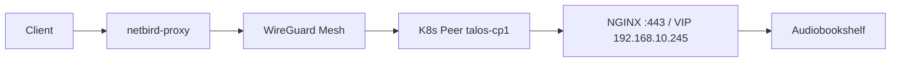

# Netbird Reverse Proxy — Homelab-Services ohne Port-Forwarding

Mit dem [Netbird Reverse Proxy](https://docs.netbird.io/manage/reverse-proxy) (ab v0.65) erreichst du interne Dienste von außen über HTTPS. Der Traffic läuft über die Netbird-Infrastruktur (`netbird.f4mily.net`); am Router musst du **keine** zusätzlichen Ports für einzelne Apps öffnen.

Offizielle Referenzen: [Reverse Proxy](https://docs.netbird.io/manage/reverse-proxy), [Troubleshooting](https://docs.netbird.io/manage/reverse-proxy/troubleshooting), [Access Logs](https://docs.netbird.io/manage/reverse-proxy/access-logs).

## Architektur (Homelab)

Der **Reverse Proxy** baut den Tunnel zum Ziel über das Management — es gibt **keine** separate Dashboard-Policy mit Source-Gruppe `netbird-proxy`. Das war eine Fehleinschätzung in einer früheren Doku-Version.

## 502 „request failed“ — typische Ursache im Talos-Cluster

Proxy Events mit **Status 502** und **Reason `request failed`** bedeuten: der Proxy hat die Anfrage angenommen, aber das **Backend** (dein Ziel) antwortet nicht — siehe [Access Logs](https://docs.netbird.io/manage/reverse-proxy/access-logs) (5xx = Backend/Connectivity).

### Issue 1: Ziel-IP = Routing-Peer selbst (sehr häufig hier)

Wenn der **Netbird-Client auf denselben Nodes** läuft wie der Ingress (DaemonSet + `hostNetwork`) und du als Reverse-Proxy-Ziel eine **Network Resource** (`Host`/`Subnet` → `192.168.10.245`) nutzt, trifft genau [Issue 1 in der offiziellen Doku](https://docs.netbird.io/manage/reverse-proxy/troubleshooting#issue-1-502-errors-when-routing-peer-forwards-to-its-own-ip) zu:

- Der Routing Peer soll Subnet-Traffic **an andere Hosts** weiterleiten.
- Leitet er auf eine **eigene** IP (hier die Ingress-VIP auf dem Node), fehlen die ACL-Regeln für „self-targeted“ Traffic → Timeout → **502**.

**Lösung für `audible.f4mily.net` und andere Cluster-Ingress-Hosts (K8s: Netbird + Ingress auf demselben Node):**

| Feld | Wert |
|------|------|
| Target type | **Peer** (nicht Host/Subnet/Network Resource) |
| Peer | z. B. `talos-cp1` (Node mit Ingress; im Dashboard „Connected“) |
| Protocol / Port | **HTTP** / **80** (nicht HTTPS/443 — siehe unten) |
| Pass Host Header | **An** |
| Rewrite Redirects | **An** |
| Domain | Custom: z. B. `audible.f4mily.net` |

Der öffentliche Reverse Proxy **beendet TLS** am Edge; zum Peer soll **HTTP auf Port 80** gehen. Bei **HTTPS/443** auf die Netbird-IP (`100.96.x.x`) schlägt die Verbindung oft fehl → Proxy Events **502 / request failed** ([Issue 2: bind/interface](https://docs.netbird.io/manage/reverse-proxy/troubleshooting#issue-2-service-bound-to-localhost-is-unreachable)).

GitOps setzt `NB_ENABLE_LOCAL_FORWARDING=true`, damit Tunnel-Traffic die lokalen Listener (NGINX `hostNetwork`) erreicht.

**Alternative:** Netbird-Client nur auf **`srv1`** (Routing Peer), Ziel **Host** `192.168.10.245` — dann kein Peer+Ingress auf einem Node und `Host`/`Subnet` funktionieren wieder.

### Weitere 502-Ursachen (Checkliste)

1. Service-Status im Dashboard **active** (nicht `tunnel_not_created`).
2. Vom Routing Peer lokal testen: `curl -skI -H 'Host: audible.f4mily.net' https://192.168.10.245/`
3. Backend bindet nicht nur `127.0.0.1` — Ingress ist OK (`hostNetwork`).
4. Audiobookshelf: Netbird-Pfad `/audiobookshelf`, kein `ssl-redirect` (siehe unten).
5. Self-hosted Debug: `NB_PROXY_DEBUG_ENDPOINT=true` → `netbird-proxy debug ping <account-id> 192.168.10.245 443`

## Netbird-Server (Docker)

[Enable Reverse Proxy](https://docs.netbird.io/selfhosted/migration/enable-reverse-proxy): `netbirdio/reverse-proxy`, Traefik **TLS passthrough**, `NB_PROXY_DOMAIN`, Token, DNS `proxy` / `*.proxy` → `netbird.f4mily.net`.

## Kubernetes (GitOps)

- Namespace `netbird`: **privileged** Pod-Security (`hostNetwork`, NET_ADMIN).
- DaemonSet `netbird`: Client **≥ 0.71**.
- **Network Routes** im Dashboard (Peers der Setup-Key-Gruppe):

| Netz | Zweck |
|------|--------|
| `10.244.0.0/16` | Pods |
| `10.96.0.0/12` | Services |
| `192.168.10.0/24` | Ingress-VIP `192.168.10.245`, Nodes |

Ohne diese Routen sieht der Proxy den Ingress nicht.

- Optional **Networks** `k8s-ingress` für VPN-Zugriff auf `192.168.10.0/24` (Mesh-Clients) — Routing Peers = K8s-Peer-Gruppe, Masquerade an, Policies Source = deine Client-Gruppen → Resource-Gruppe.
- **Reverse Proxy** zum Ingress: Target-Typ **Peer**, nicht die Network Resource.

## Services im Dashboard

**Reverse Proxy → Services → Add Service**

### Empfohlen: eine HTTP-Service-Instanz pro App (Custom Domain)

Passt zu bestehenden Ingress-Hostnames (`audible.f4mily.net`, `search.f4mily.net`, `*.cluster.f4mily.net`, …), sofern DNS öffentlich auf Netbird zeigt (z. B. CNAME → `netbird.f4mily.net`).

| Feld | Wert |
|------|------|
| Mode | **HTTP** |
| Domain | Custom: z. B. `search.f4mily.net` |
| Target type | **Peer** (K8s-Ingress auf demselben Node) **oder** **Host** `192.168.10.245` (Routing Peer z. B. `srv1`) |
| Protocol / Port | **HTTP** / **80** |
| Settings | **Pass Host Header** = an |
| Settings | **Rewrite Redirects** = an |
| Authentication | SSO / Passwort / PIN nach Bedarf |

### Alternative: Cluster-Domain unter `proxy.f4mily.net`

Netbird-verwaltete Subdomain statt Custom Domain — siehe [Reverse Proxy](https://docs.netbird.io/manage/reverse-proxy).

## DNS `audible.f4mily.net`

- **Öffentlich:** CNAME → `netbird.f4mily.net` (Reverse Proxy-TLS).
- **Lokal (AdGuard):** A → `192.168.10.245` (direkt im LAN).

Terraform: `homelab-infrastructure/dns/servers.tf` (`audible` public CNAME).

## VIP `192.168.10.245` im Cluster

Über **Networks** (IP-Routing, kein DNS für „245“):

| Komponente | Zweck |
|------------|--------|
| Resource `192.168.10.245/32` oder `192.168.10.0/24` | Ingress-VIP |
| Routing Peers | K8s-Netbird-Nodes und/oder andere Server im LAN (`srv1`, …) |
| Reverse Proxy | Ziel **Host** `192.168.10.245` + Routing Peer auf **anderem** Host |

Der K8s-DaemonSet kann als Routing Peer die VIP im Mesh bekannt machen; für den öffentlichen Reverse Proxy reicht oft ein Peer außerhalb der CP-Nodes.

## 404 / 502 / Redirect-Schleife bei `audible.f4mily.net`

| Symptom | Ursache | Fix |
|---------|---------|-----|
| **502** | Backend HTTPS/443 oder Routing-Peer → eigene VIP (Issue 1) | HTTP **80**, Peer-Ziel oder `srv1` → `192.168.10.245`, `NB_ENABLE_LOCAL_FORWARDING` |
| **404** / Endless Spinner | Proxy-Pfad `/` liefert HTML, Assets unter `/audiobookshelf/_nuxt/` → 404 | Netbird-Pfad **`/audiobookshelf`**, HTTP **80** (nicht HTTPS/443) |
| **304** + Spinner | Gecachtes `index.html` ohne passende JS-Bundles | Hard-Reload; Ingress setzt `Cache-Control: no-cache` |
| **Redirect-Schleife** (HTTP) | `nginx.org/ssl-redirect` leitet jedes HTTP auf HTTPS — ignoriert `X-Forwarded-Proto` vom Netbird-Proxy | GitOps: `ssl-redirect: false`, `redirect-to-https: true` |

### Netbird-Dashboard (`audible.f4mily.net`)

| Feld | Wert |
|------|------|
| Target | Host `192.168.10.245` (Routing Peer z. B. `srv1`) **oder** Peer `talos-cp*` bei K8s-only-Setup |
| Protocol / Port | **HTTP** / **80** |
| Path | **`/audiobookshelf`** (ohne trailing slash; App-Default seit v2.18) |
| Pass Host Header | **An** |
| Rewrite Redirects | **An** |

### GitOps (Audiobookshelf)

- Ingress: `path: /audiobookshelf` + `app-root` für `/`, `ssl-redirect: false`, `redirect-to-https: true`
- Öffentliche URL: `https://audible.f4mily.net/audiobookshelf` (oder `/` mit Redirect)

## Beispiel-Checkliste `audible`

- [ ] `netbird-proxy` läuft, Status im Dashboard: Proxy-Instanz **connected**
- [ ] Traefik TCP-Router TLS passthrough → Proxy `:8443`
- [ ] K8s: `kubectl get pods -n netbird` → Ready
- [ ] Network Routes aktiv
- [ ] Reverse-Proxy: **Peer** (oder Host `192.168.10.245` via `srv1`), **HTTP 80**, Path **`/audiobookshelf`**, Host Header + Rewrite an
- [ ] Netbird-Pods mit `NB_ENABLE_LOCAL_FORWARDING=true` (Flux)
- [ ] Service-Status **active**, Proxy Events: kein 502
- [ ] Öffentlich: `dig audible.f4mily.net` → Netbird-Host, nicht `192.168.10.245`
- [ ] `https://audible.f4mily.net` von außen (ohne VPN)

## Hinweise

- **Rosenpass**: Reverse Proxy funktioniert derzeit nicht mit Rosenpass.
- **Backends** (Nextcloud, Jellyfin, …): ggf. „trusted proxies“ / `trusted_domains` für Netbird-IP-Bereiche — siehe [Service configuration](https://docs.netbird.io/manage/reverse-proxy/service-configuration).
- **L4** (SSH, DB): separater Modus TCP/TLS; extra Ports in `docker-compose` freigeben — siehe [L4 ports](https://docs.netbird.io/selfhosted/migration/enable-reverse-proxy#exposing-l4-ports).
- Schnelltest ohne Dashboard: `netbird expose` auf einem Peer (CLI) — eher für temporäre Freigaben.

## Links

- [Troubleshooting (Issue 1)](https://docs.netbird.io/manage/reverse-proxy/troubleshooting#issue-1-502-errors-when-routing-peer-forwards-to-its-own-ip)
- [Backend trusted proxies `100.64.0.0/10`](https://docs.netbird.io/manage/reverse-proxy/service-configuration)
- [Cluster-Routing-Peers](netbird-cluster-access.md)
